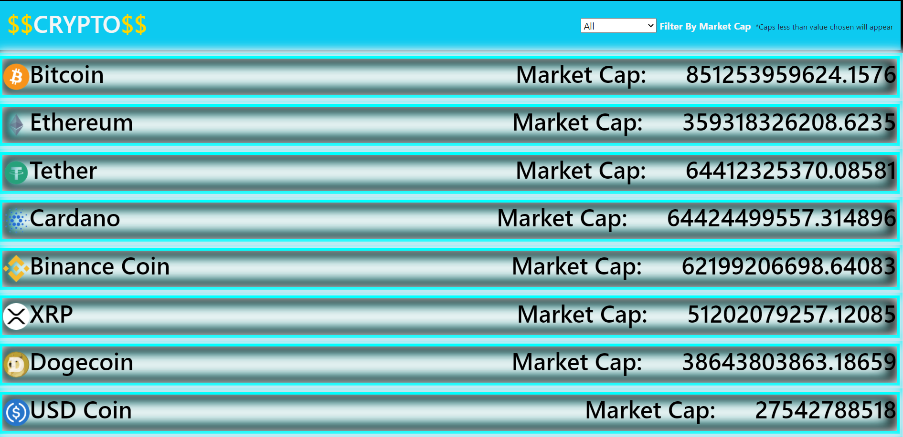

# Crypto App

> An app that displays data for the top 10 crypto currencies.

This app was built with React & Redux. It displays all of the most important data an investor would need to make any informed decision about investing in any one of the top ten crypto coins. Users can filer the coins by market capitalization.

## Built With

- Javascript, HTML, CSS.
- React & Redux.
- Webpack, Jest, Babel.

## Live Demo

[Crypto Coins](https://zealous-rosalind-906c43.netlify.app/)

## Getting Started

To run this code locally, follow these simple steps.

- Near the top of the page, there is a green button labeled "Code".
- Click on the "Code" button.
- A Menu will appear. Click on "Download Zip".
- Save the zip file to your computer.
- Extract the contents of the zip you just downloaded into a folder.

## Prerequisites

- nodeJS.
- A browser.

## Setup

- Open your command prompt.
- Go inside the folder you extracted from the zip file.
- Type `npm install`.

## Usage

- Open your command prompt.
- Go inside the folder you extracted from the zip file.
- Type `npm start` (this should open a page in your default browser and the page should load).

👤 **Paul Clue**

- GitHub: [@PaulClue](https://github.com/Paul-Clue)
- LinkedIn: [Paul Clue](https://www.linkedin.com/in/paul-clue/)

## 🤝 Contributing

Contributions, issues and feature requests are welcome!

## Show your support

Give a ⭐️ if you like this project!

## 📝 License

This project is [MIT](./LICENSE) licensed.
